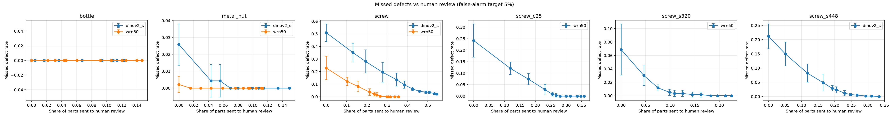
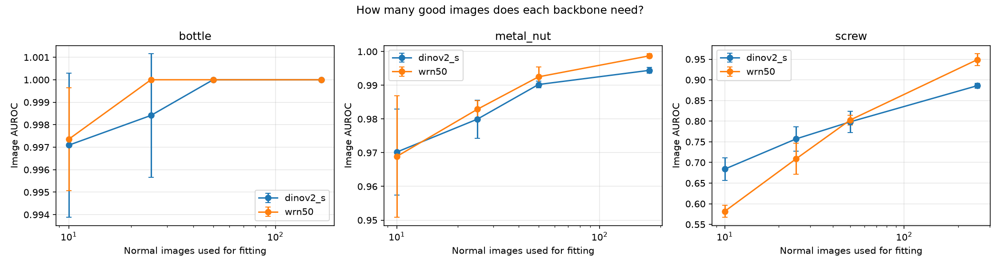
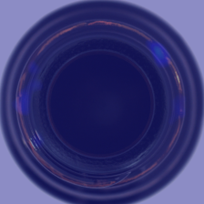
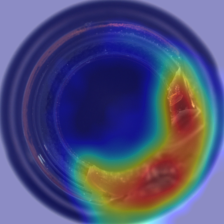

# Calibrated Industrial Defect Inspection

A visual inspection system that learns only from **defect-free** images of industrial parts, localizes defects with
heatmaps, and answers **OK**, **defect**, or **uncertain (send to a human)** instead of always guessing.
It is evaluated beyond accuracy: inference cost, how many good images it needs, and what happens when lighting,
focus or part orientation change after deployment.

Built on the [MVTec AD](https://www.mvtec.com/company/research/datasets/mvtec-ad) industrial inspection benchmark
(bottle, metal_nut, screw), with a PatchCore-style detector, two backbones (WideResNet-50 CNN and DINOv2 ViT-S/14),
split-conformal calibration, and a FastAPI inspection service.

> This project applies and evaluates existing methods (PatchCore, DINOv2, conformal prediction). It does not propose a
> new detector architecture. The contribution is the comparison under industrial criteria and the three-way decision.

## Key findings

1. **Resolution, not backbone, limited small-defect detection.** On screws, DINOv2 went from 0.886 to
   **0.978 ± 0.002** image AUROC when the input grew from 224 to 448 px (16×16 to 32×32 patch grid). At that
   resolution it matched the CNN at 320 px (0.977 ± 0.005) at about half the inference time and a third of the GPU memory.
2. **An uncertain zone trades human review for fewer missed defects.** On screws (CNN, 224 px), a single threshold missed
   23% of defective parts; the three-way decision cut this to **1.5%** by sending **25%** of parts to human review.
   On easy parts (bottle) it added reviews without any benefit, so the zone should be set per part type.
3. **Recalibration fixes lighting drift, not orientation drift.** With thresholds from the original calibration, lighting,
   blur and rotation shifts pushed false alarms up to 100%. Recalibrating with **20 good images** under the new conditions
   restored the false-alarm rate for lighting and mild blur with no increase in misses. Under rotation and strong blur it
   only traded false alarms for missed defects (up to 78% on screws), so those need fixturing or retraining.
4. **With few training images the transformer is better; with many, the CNN catches up.** On screws with 10 good images:
   DINOv2 0.68 vs. CNN 0.58 image AUROC; the two cross at about 50 images.

## How it works

**Setup, once per part type**
1. Split the defect-free training images: 80% *fit*, 20% *calibration* (never used for fitting).
2. Extract patch features from a frozen pretrained backbone and keep a coreset of normal patches (memory bank).
3. Score the calibration images; set two thresholds with split-conformal quantiles:
   `t_defect` (target false-alarm rate α = 5%) and `t_ok` (α = 30%).

**Inspection, every part**
1. Extract patch features and find each patch's nearest normal patch; the distance is its anomaly score.
2. Image score = worst patch; the heatmap is the upsampled patch-score map.
3. Decision: score ≤ `t_ok` → OK; score > `t_defect` → defect; in between → uncertain.

The conformal guarantee covers **false alarms only** (good parts called defective), and only while new good parts
resemble the calibration parts. Missed defects are measured on the test set, not guaranteed.

## Results

All numbers: mean over 5 seeds (a seed changes the fit/calibration split and the coreset start; the test set is fixed).

### Detection accuracy, speed and memory

| Part | Backbone | Input | Image AUROC | Pixel AUROC | ms / image (batch 16) | GPU memory |
|---|---|---|---|---|---|---|
| bottle | WideResNet-50 | 224 | 1.000 | 0.983 | 10.1 | 1.8 GB |
| bottle | DINOv2-S | 224 | 1.000 | 0.976 | 3.7 | 0.4 GB |
| metal_nut | WideResNet-50 | 224 | 0.999 ± 0.001 | 0.985 | 10.3 | 2.0 GB |
| metal_nut | DINOv2-S | 224 | 0.994 ± 0.001 | 0.979 | 3.6 | 0.4 GB |
| screw | WideResNet-50 | 224 | 0.949 ± 0.015 | 0.988 | 13.5 | 2.8 GB |
| screw | DINOv2-S | 224 | 0.886 ± 0.006 | 0.924 | 4.6 | 0.6 GB |
| screw | WideResNet-50 | 320 | 0.977 ± 0.005 | 0.994 | 50.9 | 5.5 GB |
| screw | DINOv2-S | 448 | **0.978 ± 0.002** | 0.985 | 25.5 | 1.9 GB |

Also tried, no reliable gain: a 25% coreset on screw (0.944 ± 0.008, about 2× slower), and a score-level ensemble of
both backbones (0.956 ± 0.011 on screw, within the seed-to-seed spread of the CNN).

Timings are batched throughput on an RTX 2000 Ada. Single-image latency (how a station actually runs) is measured with
`src.demo_batch --repeat 20` for GPU and CPU.

### Decisions: single threshold vs. three-way (α_defect = 5%, α_ok = 30%)

| Part | Backbone | False alarms | Missed defects, single threshold | Missed defects, three-way | Sent to human |
|---|---|---|---|---|---|
| bottle | WideResNet-50 | 3.0% | 0.0% | 0.0% | 6.0% |
| bottle | DINOv2-S | 8.0% | 0.0% | 0.0% | 2.2% |
| metal_nut | WideResNet-50 | 9.1% | 0.2% | 0.0% | 7.7% |
| metal_nut | DINOv2-S | 10.0% | 2.6% | 0.0% | 8.0% |
| screw | WideResNet-50 | 5.9% | 22.9% | 1.5% | 24.9% |
| screw | DINOv2-S | 3.9% | 50.9% | 9.6% | 38.4% |



**Why metal_nut misses the 5% target:** the same two good test images (`test/good/007.png`, `016.png`) are flagged in
4–5 of 5 seeds by *both* backbones. They differ from the good training nuts, which breaks the exchangeability the
guarantee relies on. With only 22 good test nuts, two images are about 9 percentage points. They were kept in the test
set, not removed.

### How many good images are needed?



Only the fit set shrinks (10 / 25 / 50 / all); the calibration set stays at 20% of the good images. At least
**19 calibration images** are needed for a 5% false-alarm target (α ≥ 1 / (n + 1)).

### Drift and recalibration (WideResNet-50, 224 px, 5 seeds)

| Part | Shift | False alarms, original thresholds | False alarms, recalibrated with 20 images | Missed defects after recalibration |
|---|---|---|---|---|
| bottle | darker (×0.7) | 100% | 5% | 0% |
| bottle | blur σ = 1 | 90% | 1% | 0% |
| metal_nut | brighter (×1.3) | 34% | 9% | 0% |
| screw | blur σ = 1 | 100% | 1% | 71% |
| screw | rotate 5° | 100% | 3% | 68% |
| bottle | rotate 15° | 100% | 0% | 58% |

Two kinds of drift appear: **score shift**, where the model still separates good from bad but the scores move (fixed by
recalibration), and **discrimination loss**, where it no longer can (needs fixturing or retraining). DINOv2 needs
recalibration less often: on metal_nut with blur σ = 1 its false alarms rose to 15%, vs. 80% for the CNN.

### Example

| Good bottle | Broken bottle |
|---|---|
|  |  |

The heatmap colour scale starts at 0.8 × `t_ok` for readability; it does not change scores or decisions.

## Limitations

- **No model weights are trained.** Backbones are frozen; "fitting" stores normal patches. Calibration and test images
  are never used for fitting.
- **Small test sets.** 20–41 good test images per part, and every seed uses the same test set, so false-alarm rates move
  in steps of 2.5–5 points and seeds do not average out test-set noise.
- **Simulated drift.** Shifts are applied to images in code; real drift (new lamps, dirty lenses, new suppliers) is messier.
  The rotation shift uses bilinear interpolation, which also slightly blurs the image.
- **Unresolved artifact.** Brightened screw test images reach image AUROC ≈ 1.0, above the clean result, which is
  implausible. It likely reflects a brightness difference between MVTec screw training and test photos; that row is
  excluded from the conclusions.
- **Deployment choice made after seeing test results.** The exported models (DINOv2 at 448 px for screw, CNN for bottle
  and metal_nut) are a recommendation read off the full comparison above, not an independent accuracy claim.
- **Simplifications vs. the PatchCore paper:** image score is the single worst patch (no reweighting), localization is
  reported as pixel AUROC rather than PRO, and the ensemble rescales scores with the calibration set, which weakens its
  conformal guarantee.

## Future work

- Rotation-augmented memory bank and test-time alignment for orientation drift
- Drift monitoring that triggers recalibration (e.g. the share of flagged parts per hour)
- PRO metric, binomial confidence intervals on false-alarm rates, more categories
- Other detectors (e.g. EfficientAD) under the same evaluation

## Run it

```bash
# setup (Python 3.12)
python -m venv .venv
.venv\Scripts\activate            # Windows
pip install torch torchvision --index-url https://download.pytorch.org/whl/cu128
pip install -r requirements.txt
# download MVTec AD (license: CC BY-NC-SA 4.0) and extract to data/mvtec/

# experiments
python -m src.run_patchcore --category screw --backbone dinov2_s --image-size 448 --seed 0
python -m src.sweep_decisions
python -m src.summarize_runs
python -m src.robustness --category screw --backbone wrn50
python -m src.recalibrate --category screw --backbone wrn50

# deployable model + service
python -m src.export_model --category screw --backbone dinov2_s --image-size 448
python -m uvicorn api.app:app --port 8000     # open http://127.0.0.1:8000
```

## Repository structure
src/data.py MVTec AD loader
src/patchcore.py backbones (WideResNet-50, DINOv2) + memory bank + scoring
src/conformal.py conformal thresholds and OK / defect / uncertain decisions
src/run_patchcore.py one experiment run (fit, calibrate, test)
src/sweep_decisions.py miss-rate vs human-review trade-off, false-alarm check
src/summarize_runs.py results table and training-data curve
src/robustness.py lighting / blur / rotation shifts
src/recalibrate.py recalibration after drift
src/inspect_false_alarms.py which good test images are flagged, across seeds
src/ensemble.py CNN + DINOv2 score ensemble
src/export_model.py save a calibrated model
src/inference.py single-image inspector with heatmap
src/demo_batch.py offline demo and single-image latency
api/app.py FastAPI service with upload page

## References

- K. Roth et al., *Towards Total Recall in Industrial Anomaly Detection* (PatchCore), CVPR 2022.
- M. Oquab et al., *DINOv2: Learning Robust Visual Features without Supervision*, 2023.
- P. Bergmann et al., *MVTec AD: A Comprehensive Real-World Dataset for Unsupervised Anomaly Detection*, CVPR 2019;
  extended version in IJCV 129(4), 2021.
- A. N. Angelopoulos and S. Bates, *A Gentle Introduction to Conformal Prediction and Distribution-Free Uncertainty
  Quantification*, 2021.

The MVTec AD dataset is licensed CC BY-NC-SA 4.0 and is not included in this repository.
